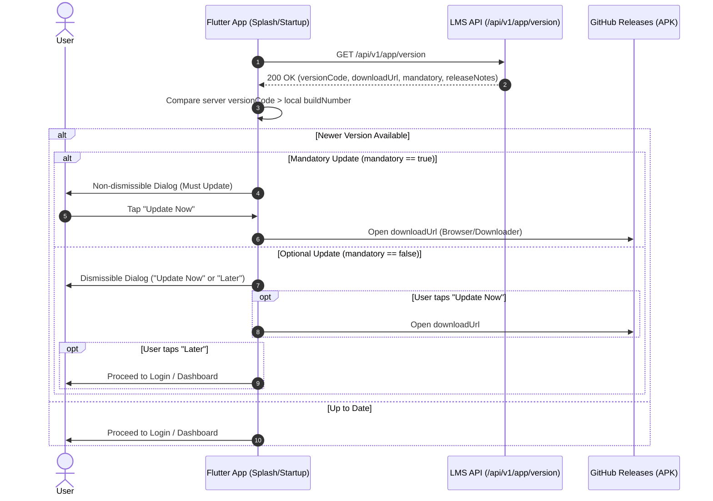

# 📱 LMS Android App Update API — Flutter Integration Guide

> **Audience**: Flutter Mobile Developers  
> **API Version**: `v1`  
> **Base Path**: `/api/v1`  
> **Endpoint**: `GET /api/v1/app/version`  
> **Authentication Required**: **No** (Public endpoint — can be called before user login)

---

## 1. Overview & Update Flow

This endpoint provides version metadata for the Android LMS application. The Flutter application calls this endpoint on startup (typically during Splash Screen or App Initialization) to check if a newer APK is available on GitHub Releases.

### Sequence Flow:



---

## 2. HTTP Request Specification

### Method & URL
```http
GET /api/v1/app/version HTTP/1.1
Host: <API_HOST>
```

### Headers
| Header | Value | Required | Description |
| :--- | :--- | :--- | :--- |
| `Accept` | `application/json` | No | Standard JSON response |
| `Authorization` | — | **No** | Do **NOT** send any Bearer token. |
| `X-Raw-Response` | `true` | Optional | If set to `true`, returns unwrapped data directly at JSON root. |

### Query Parameters
| Parameter | Type | Required | Default | Description |
| :--- | :--- | :--- | :--- | :--- |
| `raw` | `boolean` | No | `false` | When `true` (`?raw=true`), returns the data directly without the backend wrapper. |

---

## 3. Response Format

### Option A: Standard Envelope (Default)
By default, this endpoint follows the standard API wrapper format used across the entire backend:

```http
HTTP/1.1 200 OK
Content-Type: application/json
```

```json
{
  "success": true,
  "statusCode": 200,
  "message": "Operation successful",
  "data": {
    "version": "0.1.0",
    "versionCode": 1,
    "downloadUrl": "https://github.com/Shoky-ORG/App_realeses/releases/download/v0.1.0/app-release.apk",
    "mandatory": false,
    "releaseNotes": [
      "Initial release v0.1.0"
    ]
  }
}
```

### Option B: Raw Response (`?raw=true` or `X-Raw-Response: true`)
If your Flutter app prefers direct model mapping without unwrapping `data`:

```http
GET /api/v1/app/version?raw=true HTTP/1.1
```

```json
{
  "version": "0.1.0",
  "versionCode": 1,
  "downloadUrl": "https://github.com/Shoky-ORG/App_realeses/releases/download/v0.1.0/app-release.apk",
  "mandatory": false,
  "releaseNotes": [
    "Initial release v0.1.0"
  ]
}
```

---

## 4. Response Field Reference

| Field Name | Type | Description |
| :--- | :--- | :--- |
| `version` | `String` | Semantic version string (e.g. `"1.1.0"`, `"0.1.0"`). Displayed in the UI dialog. |
| `versionCode` | `int` | **Integer build number**. Used for version comparison (`versionCode > currentAppBuildNumber`). |
| `downloadUrl` | `String` | Direct HTTPS download URL for the APK (hosted on GitHub Releases). |
| `mandatory` | `bool` | `true` if this update is critical/mandatory (forces user to update); `false` if optional. |
| `releaseNotes` | `List<String>` | List of bullet points describing new features and bug fixes in this release. |

---

## 5. Flutter Implementation (Ready-to-Use Code)

### Recommended Packages (`pubspec.yaml`)
```yaml
dependencies:
  flutter:
    sdk: flutter
  http: ^1.2.0             # Or dio: ^5.4.0
  package_info_plus: ^8.0.0 # To read local app version & build number
  url_launcher: ^6.3.0      # To open downloadUrl in browser or download manager
```

---

### Step 1: Data Model (`app_version_model.dart`)

```dart
class AppVersionModel {
  final String version;
  final int versionCode;
  final String downloadUrl;
  final bool mandatory;
  final List<String> releaseNotes;

  AppVersionModel({
    required this.version,
    required this.versionCode,
    required this.downloadUrl,
    required this.mandatory,
    required this.releaseNotes,
  });

  /// Factory handles both standard wrapped { success: true, data: { ... } }
  /// and raw { version: ... } formats automatically.
  factory AppVersionModel.fromJson(Map<String, dynamic> json) {
    final payload = (json.containsKey('data') && json['data'] is Map<String, dynamic>)
        ? json['data'] as Map<String, dynamic>
        : json;

    return AppVersionModel(
      version: payload['version'] as String? ?? '1.0.0',
      versionCode: (payload['versionCode'] as num?)?.toInt() ?? 1,
      downloadUrl: payload['downloadUrl'] as String? ?? '',
      mandatory: payload['mandatory'] as bool? ?? false,
      releaseNotes: (payload['releaseNotes'] as List<dynamic>?)
              ?.map((e) => e.toString())
              .toList() ??
          [],
    );
  }
}
```

---

### Step 2: Update Check Service (`app_update_service.dart`)

```dart
import 'dart:convert';
import 'package:http/http.dart' as http;
import 'package:package_info_plus/package_info_plus.dart';
import 'app_version_model.dart';

class AppUpdateService {
  final String baseUrl;

  AppUpdateService({required this.baseUrl});

  /// Fetches release info and returns AppVersionModel if an update is available,
  /// or null if the installed version is up to date or if the check fails.
  Future<AppVersionModel?> checkForUpdate() async {
    try {
      final url = Uri.parse('$baseUrl/api/v1/app/version');
      final response = await http.get(url).timeout(const Duration(seconds: 8));

      if (response.statusCode == 200) {
        final decoded = jsonDecode(response.body) as Map<String, dynamic>;
        final updateInfo = AppVersionModel.fromJson(decoded);

        // Get currently installed app build number
        final packageInfo = await PackageInfo.fromPlatform();
        final currentBuildNumber = int.tryParse(packageInfo.buildNumber) ?? 0;

        // Compare versionCode
        if (updateInfo.versionCode > currentBuildNumber) {
          return updateInfo; // Newer version available!
        }
      }
    } catch (e) {
      // Fail safely: Log error, do not block user startup if server/network fails
      print('[AppUpdateService] Error checking for update: $e');
    }
    return null;
  }
}
```

---

### Step 3: Update Dialog Widget (`show_update_dialog.dart`)

```dart
import 'dart:io';
import 'package:flutter/material.dart';
import 'package:flutter/services.dart';
import 'package:url_launcher/url_launcher.dart';
import 'app_version_model.dart';

void showAppUpdateDialog(BuildContext context, AppVersionModel updateInfo) {
  showDialog(
    context: context,
    // If update is mandatory, user cannot dismiss the dialog by tapping outside
    barrierDismissible: !updateInfo.mandatory,
    builder: (BuildContext ctx) {
      return WillPopScope(
        // Prevent hardware back button if mandatory
        onWillPop: () async => !updateInfo.mandatory,
        child: AlertDialog(
          shape: RoundedRectangleBorder(borderRadius: BorderRadius.circular(16)),
          title: Row(
            children: [
              const Icon(Icons.system_update_rounded, color: Colors.blueAccent, size: 28),
              const SizedBox(width: 8),
              Text(
                updateInfo.mandatory ? 'Update Required' : 'New Update Available',
                style: const TextStyle(fontWeight: FontWeight.bold),
              ),
            ],
          ),
          content: SingleChildScrollView(
            child: Column(
              crossAxisAlignment: CrossAxisAlignment.start,
              mainAxisSize: MainAxisSize.min,
              children: [
                Text(
                  'Version ${updateInfo.version} is now available.',
                  style: const TextStyle(fontWeight: FontWeight.w600),
                ),
                const SizedBox(height: 12),
                if (updateInfo.releaseNotes.isNotEmpty) ...[
                  const Text(
                    'What\'s New:',
                    style: TextStyle(fontWeight: FontWeight.bold, fontSize: 13),
                  ),
                  const SizedBox(height: 6),
                  ...updateInfo.releaseNotes.map(
                    (note) => Padding(
                      padding: const EdgeInsets.symmetric(vertical: 2),
                      child: Row(
                        crossAxisAlignment: CrossAxisAlignment.start,
                        children: [
                          const Text('• ', style: TextStyle(fontWeight: FontWeight.bold)),
                          Expanded(child: Text(note)),
                        ],
                      ),
                    ),
                  ),
                  const SizedBox(height: 12),
                ],
                if (updateInfo.mandatory)
                  const Text(
                    'This update contains critical improvements. You must update to continue using the application.',
                    style: TextStyle(color: Colors.redAccent, fontSize: 12),
                  ),
              ],
            ),
          ),
          actions: [
            if (!updateInfo.mandatory)
              TextButton(
                onPressed: () => Navigator.of(ctx).pop(),
                child: const Text('Later'),
              ),
            ElevatedButton(
              style: ElevatedButton.styleFrom(
                backgroundColor: Colors.blueAccent,
                foregroundColor: Colors.white,
                shape: RoundedRectangleBorder(borderRadius: BorderRadius.circular(8)),
              ),
              onPressed: () async {
                final uri = Uri.parse(updateInfo.downloadUrl);
                if (await canLaunchUrl(uri)) {
                  await launchUrl(uri, mode: LaunchMode.externalApplication);
                }
              },
              child: const Text('Update Now'),
            ),
          ],
        ),
      );
    },
  );
}
```

---

### Step 4: Calling on Startup (Splash Screen Example)

```dart
class SplashScreenState extends State<SplashScreen> {
  @override
  void initState() {
    super.initState();
    _initApp();
  }

  Future<void> _initApp() async {
    final updateService = AppUpdateService(baseUrl: 'https://your-api-domain.com');
    final updateInfo = await updateService.checkForUpdate();

    if (!mounted) return;

    if (updateInfo != null) {
      showAppUpdateDialog(context, updateInfo);
      if (!updateInfo.mandatory) {
        // Optional: proceed after showing dialog or user tap
      }
    } else {
      // No update, navigate to Login or Home
      Navigator.pushReplacementNamed(context, '/login');
    }
  }

  @override
  Widget build(BuildContext context) {
    return const Scaffold(
      body: Center(child: CircularProgressIndicator()),
    );
  }
}
```

---

## 6. Error Handling & Edge Cases

| Scenario | Behavior | Recommended Flutter Action |
| :--- | :--- | :--- |
| **No Internet / Server Offline** | Request times out or throws `SocketException` | Catch exception silently and allow user to continue (unless app requires active online sync). |
| **HTTP 429 Too Many Requests** | Exceeded 60 requests/minute | Ignore and proceed normally to avoid blocking users. |
| **HTTP 404** | No release configured on server | Do nothing; app is assumed up to date. |
| **`mandatory: true`** | Critical update required | Do not allow dismissal (`barrierDismissible: false`, intercept `WillPopScope`). |
